My name is **Amir**, but you may find me as **amirmiir** (a pun for my name and sleeping in my mother tongue)

*Take the next step to build and design software to evolve as a software developer.*

<table>
  <tr>
    <td width="50%" valign="top">
      <h3 align="center">About me...</h3>
      

        My full name is <strong>Amir Canto Gamboa</strong> and I am currently a <strong>Computer Science</strong> undergrad student at <strong>National University of Engineering</strong> in Lima.
      

      

        I was born in Perú and I have found problem solving as an essential part of my day to day life and professional path. I have been developing software for a couple of years, and I am looking to solidify myself as a <strong>Full-Stack Developer</strong>.
      

    </td>
    <td width="50%" valign="top">
      <h3 align="center">Technical Stack</h3>
      

        <strong>Languages</strong> 
        
      

      

        <strong>Frontend</strong> 
        
      

      

        <strong>Backend & Databases</strong> 
        
      

      

        <strong>Cloud & DevOps</strong> 
        
      

      

        <strong>Tools & Testing</strong> 
        
      

    </td>
  </tr>
</table>

  
    
  

### Connections

